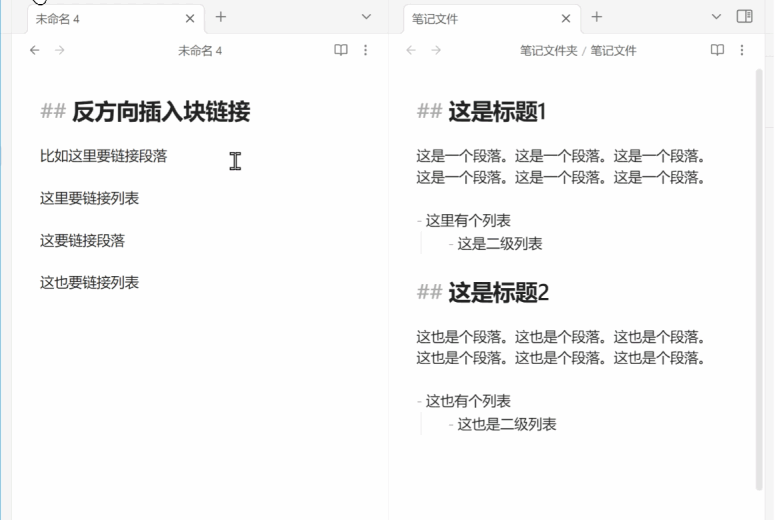

# 这是一个 [Obsidian](https://obsidian.md) 的插件

插件的作用是在当前块链接的目标文件文本块末尾，反向添加一个链接到当前文件文本块的块链接。实现块与块之间的双向链。接。

## 如何使用

在编辑模式下，把光标放在块链接的文字中，然后执行命令即可。

此插件提供6个命令，其中四个命令定义了插入反向链接所呈现的方式。`[[path/file-name#^185028|text]]`

1. 以文件名呈现链接：`[[path/file-name#^185028|file-name]]`
2. 原样显示链接：`[[path/file-name#^185028]]`
3. 显示为脚注的形式：`^[[[path/file-name#^185028]]]`
4. 显示文字为自定义文字`^`，作为另一种脚注的替代，设置界面可以自行设定：`[[path/file-name#^185028|^]]`

对于不方便马上在目标块位置插入反向块链接的情况，可以使用记录当前块链接命令，插件会记录当前块的链接，如果当前块链接没有块 ID 则会自动为当前块生成一个块 ID 。然后把光标放在在需要插入反向链接的位置，执行插入记录中的链接命令。

## 演示

